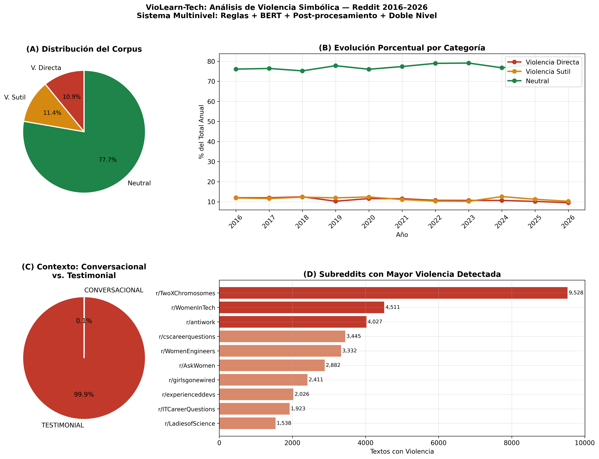
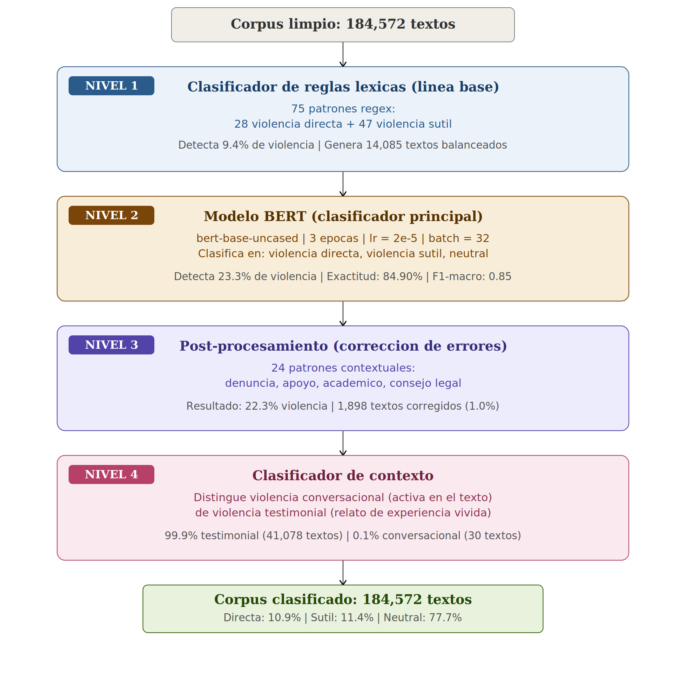
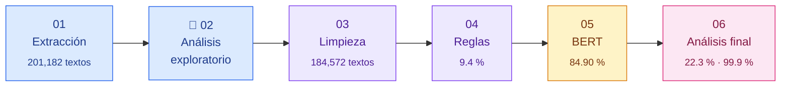

<div align="center">

# ViolenciaTechReddit

### Detección Multinivel de Violencia Simbólica contra Mujeres en Comunidades Tecnológicas de Reddit mediante BERT

*Sistema multinivel basado en BERT para la detección automática de violencia simbólica, capaz de distinguir entre la violencia ejercida y la violencia relatada en el discurso digital.*

<br>

[](https://www.python.org/)
[](https://pytorch.org/)
[](https://colab.research.google.com/)
[](https://www.reddit.com/dev/api/)


<br>

**[Artículo](#-publicación) · [Resultados](#-resultados-principales) · [Arquitectura](#️-arquitectura-del-sistema) · [Cómo ejecutar](#-cómo-ejecutar-el-pipeline) · [Citar](#-cómo-citar)**

</div>

---

## 📖 Sobre el proyecto

La **violencia simbólica** (Bourdieu, 2000) es una forma de dominación tan normalizada que ni quien la ejerce ni quien la recibe la reconoce como violencia. En tecnología se manifiesta como el cuestionamiento de la competencia técnica de las mujeres, el *mansplaining*, la atribución de sus logros a cuotas de diversidad o la normalización de culturas laborales excluyentes.

La mayoría de los sistemas de detección de discurso de odio buscan insultos y lenguaje explícito, por lo que **no detectan estas formas sutiles**. Además, no distinguen entre quien **ejerce** violencia y quien **relata** haberla vivido.

Este proyecto propone un **sistema de cuatro niveles** que analiza **184,572 textos** de **17 comunidades de Reddit** entre **2016 y 2026** para responder tres preguntas:

> 🔹 ¿Cuánta violencia simbólica existe en estas comunidades?
> 🔹 ¿De qué tipo es: directa o sutil?
> 🔹 ¿Cómo ha cambiado a lo largo de una década?

---

## 📊 Resultados principales

<div align="center">

| | Indicador | Resultado |
|:---:|:---|:---:|
| | Accuracy del modelo BERT | **84.90 %** |
| | F1-macro | **0.85** |
| | Violencia detectada por reglas (línea base) | 9.4 % |
| | Violencia detectada por BERT | 23.3 % *(2.5× más que las reglas)* |
| | Violencia tras post-procesamiento | **22.3 %** |
| | Violencia directa / 🟠 sutil / 🟢 neutral | 10.9 % / 11.4 % / 77.7 % |
| | Violencia **testimonial** (relatos de experiencias vividas) | **99.9 %** |
| | Tendencia 2016–2026 | ↓ significativa (r² = 0.58, p = 0.0067) |

</div>

### Hallazgos clave

- ** Las comunidades funcionan como redes de apoyo.** El 99.9 % de la violencia detectada corresponde a mujeres relatando experiencias vividas en otros espacios; solo **30 textos** contienen agresiones activas dentro de la conversación.
- ** La violencia sutil es tan frecuente como la directa.** Casi la mitad de la violencia detectada no usa lenguaje explícito.
- ** La violencia disminuye, pero lentamente.** Baja alrededor de 0.36 puntos porcentuales por año, y aun así se mantiene por encima del 20 % en casi todo el periodo.
- ** El tipo de violencia depende del espacio.** En comunidades técnicas (r/learnprogramming, r/experienceddevs, r/webdev) predomina la violencia sutil; en r/TwoXChromosomes y r/antiwork predomina la directa.

<div align="center">

<br>
<sub><i>Distribución del corpus, evolución por categoría, contexto conversacional vs. testimonial y subreddits con más violencia detectada.</i></sub>
</div>

---

##  Arquitectura del sistema

El sistema procesa cada texto en **cuatro niveles consecutivos**:

| Nivel | Componente | Función |
|:---:|:---|:---|
| 🔵 **1** | **Clasificador de reglas léxicas** | 75 patrones regex (28 de violencia directa y 47 de sutil). Funciona como línea base y genera el dataset balanceado de entrenamiento (14,085 textos). |
| 🟤 **2** | **Modelo BERT** | Fine-tuning de `bert-base-uncased` que clasifica cada texto en violencia directa, violencia sutil o neutral a partir del contexto completo. |
| 🟣 **3** | **Post-procesamiento** | 24 patrones contextuales que corrigen falsos positivos: textos de denuncia, apoyo, análisis académico o consejo legal. Corrigió 1,898 textos. |
| 🔴 **4** | **Clasificador de contexto** | Distingue la violencia **conversacional** (ejercida en el propio texto) de la **testimonial** (relato de una experiencia vivida). |

<div align="center">

</div>

<details>
<summary><b>⚙️ Configuración del modelo BERT</b> (clic para ver)</summary>
<br>

| Hiperparámetro | Valor |
|:---|:---|
| Modelo base | `bert-base-uncased` (109M parámetros) |
| Longitud máxima | 128 tokens |
| Épocas | 3 |
| Learning rate | 2 × 10⁻⁵ |
| Batch size | 32 |
| Optimizador | AdamW (weight decay 0.01) |
| Warm-up | 10 % de los pasos |
| División de datos | 70 % entrenamiento · 15 % validación · 15 % prueba (estratificada) |
| Hardware | GPU NVIDIA T4 (Google Colab) |

</details>

---

## 🔄 Pipeline



| Notebook | Descripción | Entorno |
|:---|:---|:---:|
| `01_Extraccion_Reddit.ipynb` | Extracción con la API oficial de Reddit (PRAW) usando 58 palabras clave en 17 subreddits | 💻 Local |
| `02_Analisis_Exploratorio.ipynb` | Estadísticas descriptivas, timeline mensual y actividad por comunidad | 💻 Local |
| `03_Limpieza_Preprocesamiento.ipynb` | 7 pasos de limpieza de texto y 4 filtros de calidad | 💻 Local |
| `04_Clasificacion_Reglas.ipynb` | Clasificador de reglas (Nivel 1) y generación del dataset balanceado | 💻 Local |
| `05_BERT_Colab.ipynb` | Fine-tuning y evaluación de BERT (Nivel 2); clasificación del corpus completo | ☁️ Colab + GPU |
| `06_Final_Analisis.ipynb` | Post-procesamiento (Nivel 3), clasificador de contexto (Nivel 4), **análisis temporal**, figuras y tablas del artículo | 💻 Local |

> [!NOTE]
> El análisis temporal (paso 6 de la Figura 1 del artículo) está integrado en el notebook `06_Final_Analisis.ipynb`, porque se calcula después del post-procesamiento.

---

## 📁 Estructura del repositorio

```
ViolenciaTechReddit/
│
├──  notebooks/                    Pipeline completo
│   ├── 01_Extraccion_Reddit.ipynb
│   ├── 02_Analisis_Exploratorio.ipynb
│   ├── 03_Limpieza_Preprocesamiento.ipynb
│   ├── 04_Clasificacion_Reglas.ipynb
│   ├── 05_BERT_Colab.ipynb
│   └── 06_Final_Analisis.ipynb
│
├──  data/
│   ├── raw/                         IDs públicos del corpus (reddit_ids_publicos.csv)
│   ├── processed/                   CSVs limpios y clasificados (no incluidos)
│   └── models/                      Modelo BERT entrenado (no incluido)
│
├──  images/
│   ├── diagramas/                   Diagramas de arquitectura
│   ├── exploratorio/                Figuras del análisis exploratorio
│   └── resultados/                  Figuras de resultados (español y *_en.png en inglés)
│
├──  config/
│   └── credentials_template.py      Plantilla de credenciales de la API de Reddit
│
├── .gitignore
├── LICENSE
└── README.md
```

---

## 🚀 Cómo ejecutar el pipeline

### 1️⃣ Requisitos

**Notebooks locales (01–04 y 07)**
- Python 3.10 o superior (desarrollado con Python 3.11)
- `pandas`, `numpy`, `matplotlib`, `seaborn`, `scipy`, `scikit-learn`
- `praw==7.7.1` (solo para la extracción)

**Notebook 05 (Google Colab)**
- Cuenta de Google con acceso a Colab y GPU T4
- `transformers==4.40.0`, `torch`, `scikit-learn`

### 2️⃣ Instalación

```bash
git clone https://github.com/mariimanguito/ViolenciaTechReddit.git
cd ViolenciaTechReddit
pip install pandas numpy matplotlib seaborn scipy scikit-learn praw==7.7.1
```

### 3️⃣ Credenciales de Reddit

Completa tus credenciales de la [API de Reddit](https://www.reddit.com/prefs/apps):

### 4️⃣ Orden de ejecución

```
01 → 02 → 03 → 04 → 05 (Colab) → 06
```

<details>
<summary><b> Pasos para el notebook 05 en Google Colab</b> (clic para ver)</summary>
<br>

1. Sube `data/processed/reddit_data_balanceado_bert.csv` a tu Google Drive.
2. Sube `data/processed/reddit_data_clasificado_reglas.csv` a tu Google Drive.
3. Abre `05_BERT_Colab.ipynb` en Colab y ajusta `RUTA_DRIVE` a tu carpeta.
4. Selecciona **Entorno de ejecución → Cambiar tipo de entorno → GPU T4**.
5. Ejecuta todas las celdas (el entrenamiento tarda unos 11 minutos).
6. Descarga `reddit_data_clasificado_BERT.csv` y colócalo en `data/processed/`.

</details>

> [!IMPORTANT]
> **Sobre la reproducibilidad de BERT.** El entrenamiento incluye componentes aleatorios (inicialización de la capa de clasificación y orden de los lotes), por lo que volver a entrenar produce resultados ligeramente distintos (alrededor de 84.9 % de accuracy). Los resultados publicados corresponden a la ejecución guardada en `05_BERT_Colab.ipynb`. Las etapas 01–04 y 07 son deterministas.

---

## Datos y privacidad

Por privacidad de las personas usuarias y por los términos de servicio de Reddit, **este repositorio no incluye los textos del corpus ni los nombres de usuario**.

En su lugar, `data/raw/reddit_ids_publicos.csv` contiene los identificadores de los 201,182 textos extraídos:

| Columna | Descripción |
|:---|:---|
| `id` | Identificador de Reddit del post o comentario |
| `subreddit` | Comunidad de origen |
| `tipo` | `post` o `comment` |
| `fecha` | Fecha de publicación (UTC) |
| `en_corpus_limpio` | `True` si el texto forma parte de los 184,572 del corpus final |

<details>
<summary><b> Cómo reconstruir el corpus con la API de Reddit</b> (clic para ver)</summary>
<br>

```python
import pandas as pd
import praw

reddit = praw.Reddit(client_id="...", client_secret="...", user_agent="...")

ids = pd.read_csv("data/raw/reddit_ids_publicos.csv")
ids = ids[ids["en_corpus_limpio"]]

# Reddit usa prefijos: t3_ para posts y t1_ para comentarios
prefijo = ids["tipo"].map({"post": "t3_", "comment": "t1_"})
fullnames = (prefijo + ids["id"]).tolist()

for item in reddit.info(fullnames=fullnames[:100]):  # en lotes de 100
    texto = item.selftext if hasattr(item, "selftext") else item.body
    print(item.id, texto[:80])
```

Algunos textos pueden ya no estar disponibles si fueron borrados después de la extracción (marzo de 2026).

</details>

---

## 🌐 Comunidades analizadas

<table>
<tr>
<th align="center"> Apoyo para mujeres (5)</th>
<th align="center"> Profesionales mixtas (9)</th>
<th align="center"> Laborales y generales (3)</th>
</tr>
<tr>
<td valign="top">

r/TwoXChromosomes<br>
r/WomenInTech<br>
r/girlsgonewired<br>
r/LadiesofScience<br>
r/WomenEngineers

</td>
<td valign="top">

r/cscareerquestions<br>
r/ITCareerQuestions<br>
r/experienceddevs<br>
r/AskComputerScience<br>
r/programming<br>
r/learnprogramming<br>
r/webdev<br>
r/datascience<br>
r/MachineLearning

</td>
<td valign="top">

r/technology<br>
r/antiwork<br>
r/AskWomen

</td>
</tr>
</table>

---

## Publicación

Este trabajo fue publicado en el ***International Journal of Combinatorial Optimization Problems and Informatics*** (IJCOPI), vol. 17, núm. 5, 2026, pp. 14–36.

###  Cómo citar

Si utilizas este trabajo, por favor cita el artículo:

> Camacho-Pérez, M., Clavel-Maqueda, M., & Cornejo-Velazquez, E. (2026). Multilevel Detection of Symbolic Violence Against Women in Reddit's Tech Communities Using BERT. *International Journal of Combinatorial Optimization Problems and Informatics, 17*(5), 14–36. https://doi.org/10.61467/2007.1558.2026.v17i5.1404

<details>
<summary><b>BibTeX</b></summary>

```bibtex
@article{camacho2026multilevel,
  title   = {Multilevel Detection of Symbolic Violence Against Women in Reddit's Tech Communities Using BERT},
  author  = {Camacho-P{\'e}rez, Maricarmen and Clavel-Maqueda, Mireya and Cornejo-Velazquez, Eduardo},
  journal = {International Journal of Combinatorial Optimization Problems and Informatics},
  volume  = {17},
  number  = {5},
  pages   = {14--36},
  year    = {2026},
  doi     = {10.61467/2007.1558.2026.v17i5.1404}
}
```

</details>

---

## Autoría

<div align="center">

**Maricarmen Camacho Pérez**
<br>
Licenciatura en Ciencias Computacionales · Universidad Autónoma del Estado de Hidalgo

[](https://github.com/mariimanguito)
[](https://www.linkedin.com/in/maricarmen20)

</div>

---

<br>
<sub>Investigación orientada a visibilizar la violencia simbólica y a promover espacios tecnológicos más equitativos.</sub>
</div>
